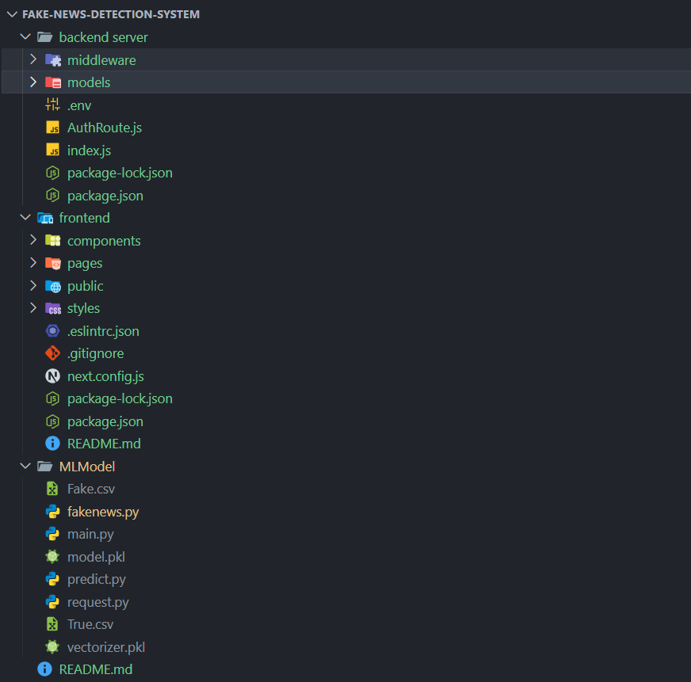

# 📰 Fake News Detection System

A full-stack web platform that detects fake news using a machine learning model hosted as an external API. The frontend allows users to input news text, which is sent to the backend and forwarded to a Python-based ML service running on a specific port.

---

## ⚙️ System Architecture

```
[Frontend (Next.js)] ───▶ [Backend (Node.js)] ───▶ [ML Model (Python Flask/FastAPI)]
                                ▲                          │
                                └─────── [Receives Result and Responds]
```

---

## 🌟 Features

- 🔍 Detects fake or real news based on user input
- 📡 ML model listens on a specific port for POST requests
- 🔐 Google Authentication for user login
- 💬 Commenting system for articles
- 🛡️ Token-based authentication

---

## 🛠️ Tech Stack

### Frontend
- **Next.js (React)**
- **Axios** for API calls

### Backend
- **Node.js + Express**
- **MongoDB + Mongoose**
- **JWT** for secure authentication

### ML Model
- **Python (Flask/FastAPI)**
- Trained model accepts text via POST and returns prediction (`fake` or `real`)

---

## 📁 Folder Structure

```



---

## 🚀 Running the Project

### Step 1: Start the ML Model API

Make sure your **Python ML model** is running on a specific port (e.g. `http://localhost:5000/predict`)

Example Flask server (simplified):

```python
from flask import Flask, request, jsonify
app = Flask(__name__)

@app.route('/predict', methods=['POST'])
def predict():
    data = request.json
    text = data.get('text')
    # Run model inference here
    return jsonify({'prediction': 'fake'})

app.run(port=5000)
```

---

### Step 2: Setup the Backend (Node.js)

```bash
cd "Fake News Detection System/website part/Backend"
npm install
cp .env.example .env    # Fill in MongoDB URI, JWT secret, etc.
node index.js
```

---

### Step 3: Start the Frontend (Next.js)

```bash
cd ..
npm install
npm run dev
```

Visit: [http://localhost:3000]

---

## 🔐 .env Configuration

In `Backend/.env`:

```env
MONGO_URI=mongodb+srv://<your-mongo-uri>
JWT_SECRET=your_jwt_secret
ML_MODEL_URL=http://localhost:5000/predict
```

---

## 🧪 How It Works

1. User enters a news article text in the frontend `/Analyze` page
2. Frontend sends a POST request to the Node.js backend
3. Backend forwards the request to the Python ML model at `ML_MODEL_URL`
4. ML model returns a prediction (`fake` or `real`)
5. Result is displayed to the user

---

## 📈 Future Scope

- Show confidence score or explanation from the model
- Upload documents or URLs for analysis
- Track analytics of fake news detection
- Admin moderation dashboard

---

## 📄 License

____

## 👨‍💻 Author

Developed by [Naveen Kamalla](https://github.com/Navy17)
